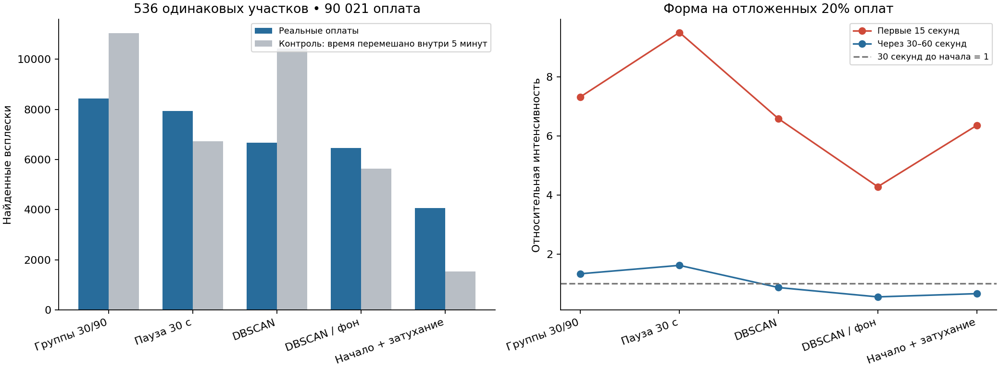
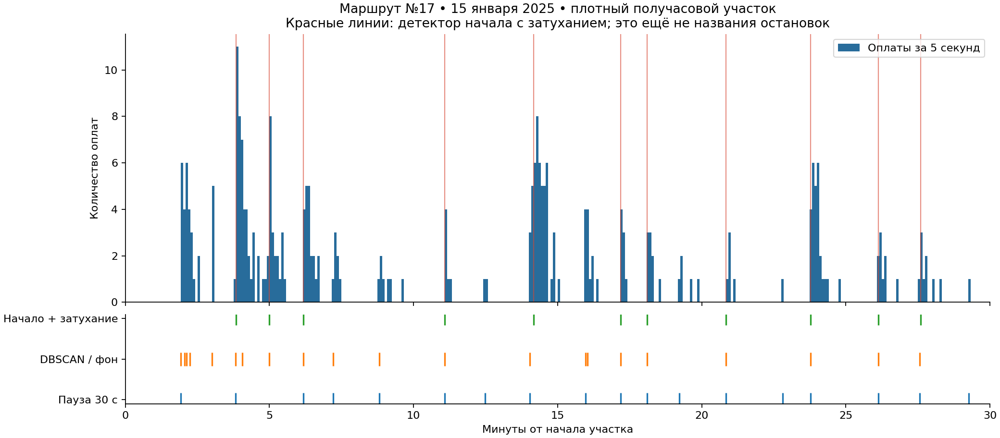

# Всплески оплат: проверка детекторов и привязки к остановкам

Эксперимент 26 сентября 2026 года, TASK-066. **Гипотеза о резком начале с последующим затуханием поддерживается реальными оплатами.** После нормализации фоновой плотности детектор находит 4 062 всплеска против 1 531 в контрольных рядах с тем же количеством оплат в каждой пятиминутке. На независимых от обнаружения оплатах интенсивность первых 15 секунд выше предшествующей в 6,36 раза и интенсивности через 30–60 секунд — в 9,59 раза.

Это подтверждает наличие коротких импульсов оплаты. Пока не подтверждено, что каждый импульс соответствует ровно одной остановке или что её название восстановлено правильно. Новые методы реализованы как воспроизводимый эксперимент; разметка для обучения и serving автоматически не заменены.

## Что проверено на реальных данных

Ранжирование сделано по всем 304 дням успешных оплат исходного набора, всего 59 667 191. Лидеры: маршрут **17 — 14 099 382**, **12 — 9 339 231**, **11 — 8 942 462**. Полный рейтинг — [ranking.json](ranking.json).

Сам эксперимент охватывает 20 фиксированных дат: 15-е и 18-е числа января–октября 2025 года, все девять маршрутов. В каждой паре маршрут/день выбираются до трёх сессий с наибольшим числом оплат в 30-минутном окне. Выбор происходит до обнаружения всплесков и сопоставления расписания. Получилось **536 окон, 90 021 оплата**. Поэтому это целевая проверка плотных участков, а не оценка качества на всех 59,7 млн оплат.

Используются существующие inferred_vehicle_pool-группы; сессии с конфликтами идентичности исключены. Такая группировка не является доказанной идентичностью физического вагона. Время — Europe/Moscow. Исходные оплаты неизменны. Сравниваются одинаковые окна; в контрольном ряду каждая оплата получает случайное время внутри своей исходной пятиминутки. Количество оплат по пятиминуткам сохраняется точно, короткие импульсы разрушаются.

## Шесть способов найти всплеск

1. Старый способ: разрыв после паузы более 30 секунд либо после достижения 90 секунд от начала группы.
2. Разделение только по паузе более 15 секунд.
3. Разделение только по паузе более 30 секунд.
4. DBSCAN во времени: eps=8 секунд, минимум 3 оплаты. Шум не считается всплеском.
5. DBSCAN после нормализации фоновой плотности: время преобразуется в накопленное ожидаемое число оплат; eps=0,75 ожидаемой оплаты, минимум 4 события. Поэтому одинаковый временной промежуток в час пик и в тихий период имеет разный вес.
6. Детектор резкого начала и затухания, описанный ниже. Это фиксированный шаблон, не обученный классификатор.

Для методов 5–6 поток разбивается на пятисекундные интервалы. Фон — средняя интенсивность в центрированном окне 305 секунд с поправкой на доступную длину у границ; нижний предел 0,1 оплаты на пятисекундный интервал. Это локальная нормализация, а не один порог на весь день. Кластеры DBSCAN длиннее 180 секунд считаются неразрешёнными и не используются как всплески. Оплаты из шума и неразрешённых кластеров остаются в исходных данных.

### Детектор начала

Пусть c[t] — количество оплат за 5 секунд, b[t] — локальный фон. Для каждого возможного начала рассчитывается:

`score(t) = sum_j(exp(-5*j/15) * (c[t+j] - b[t+j])) / sqrt(sum_j(b[t+j] * exp(-5*j/15)^2))`, j=0…11.

Дополнительные условия:

- минимум 3 оплаты за первые 10 секунд;
- за первые 15 секунд оплат не меньше, чем за следующие 15;
- интенсивность первых 15 секунд выше интенсивности предшествующих 20 секунд более чем в 1,5 раза;
- score ≥ 2,5; между выбранными началами не менее 30 секунд, при конфликте сохраняется более сильный кандидат.

Моментом начала считается **первая фактическая оплата** после выбранной границы пятисекундного интервала. К всплеску относятся события следующих 60 секунд, с обрезкой по следующему началу. Это не измерение времени открытия дверей: неизвестная задержка входа и валидации остаётся.

Алгоритм офлайн: использует будущие 60 секунд и центрированный фон. У краёв окна, где недостаточно контекста, начало не определяется. Это видно и на примере ниже. Параметры пока фиксированы; их превосходство над всеми возможными настройками не доказано.

## Проверка самого обнаружения

| Детектор | Всплески | Контроль с перемешиванием | Оплаты внутри выделенных всплесков | Начала, сохранившиеся после удаления 20% оплат | Плотные цепочки из 12 всплесков |
|---|---:|---:|---:|---:|---:|
| Пауза 30 с / предел 90 с | 8,424 | 11,039 | 100.0% | 94.0% | 444 |
| DBSCAN по секундам | 6,669 | 10,429 | 89.4% | 88.7% | 312 |
| Резкое начало + затухание | 4,062 | 1,531 | 66.9% | 87.6% | 22 |
| Пауза 15 с | 10,507 | 17,909 | 100.0% | 93.7% | 384 |
| Пауза 30 с | 7,935 | 6,730 | 100.0% | 95.2% | 405 |
| DBSCAN по нормализованной плотности | 6,458 | 5,632 | 77.9% | 82.6% | 189 |

Совпадение начал допускает ±15 секунд и считается один-к-одному. Это устойчивость к прореживанию, не точность по дверным событиям. «Оплаты внутри всплесков» — охват ассоциацией событий, не полнота остановок. У нового детектора покрыто 60 264 оплаты из 90 021; исключать оставшиеся из общего пассажиропотока нельзя.

Контроль даёт важное различие: обычный DBSCAN и короткий порог паузы выделяют даже больше групп после разрушения импульсов. Само количество групп не подтверждает остановочный характер. У нормализованного DBSCAN различие небольшое: 6 458 против 5 632. У начала с затуханием — 4 062 против 1 531, отношение 2,65. Число контрольных всплесков **не является оценкой ложноположительной доли** на реальных остановках: контроль сохраняет только пятиминутную интенсивность, использована одна фиксированная реализация.

Независимая проверка формы: детектор работает на случайно оставленных 80% оплат, профиль измеряется на остальных 20%, которые он не видел. Для 3 690 начал с полным контекстом в отложенной части получено 2 029 оплат за предшествующие 30 секунд, 6 455 за первые 15 и 1 346 за секунды 30–60. После деления на длительность окон получаются отношения **6,36** и **9,59**. Это не случайный train/test split для прогноза: это диагностическое прореживание одного потока. Пересекающиеся окна не независимы; доверительные интервалы не оценивались.



В старом способе 489 границ вызваны только пределом 90 секунд, без требуемой паузы: 6,20% из 7 888 внутренних границ. Это источник искусственного ритма, но он не объясняет все найденные всплески.

На синтетике с известным моментом импульса проверены девять сочетаний фоновой интенсивности (0,02/0,08/0,2 оплаты в секунду) и размера импульса (5/15/30 ожидаемых оплат). Интервал между импульсами 180 секунд, задержка оплаты экспоненциальная со средним 12 секунд. При допуске ±20 секунд новый детектор даёт precision 98,1%, recall 88,9%; нормализованный DBSCAN — 53,8%/94,2%. **Это результат на заданной модели импульса, не точность на московских остановках.** Детали: [synthetic.json](synthetic.json).

## Самые загруженные маршруты

По 60 выбранных окон на каждом маршруте. Усиление измерено на отложенных оплатах.

| Маршрут | Всплески «начало + затухание» | Контроль | Усиление первых 15 секунд к фону перед началом | Плотные цепочки из 12 |
|---|---:|---:|---:|---:|
| 17 | 614 | 162 | 6,55× | 14 |
| 12 | 487 | 184 | 5,19× | 0 |
| 11 | 469 | 188 | 5,70× | 1 |

На всех трёх маршрутах импульсный сигнал есть. Строгий детектор выделяет слишком мало непрерывных плотных цепочек, чтобы по нему одному проверять все остановки маршрута. Отсутствие 12 подряд на маршруте 12 не означает отсутствия всплесков: там найдено 487 отдельных начал.



Пример — самое загруженное выбранное окно маршрута 17 за 15 января 2025 года. Горизонтальная ось показывает минуты от начала окна; вертикальные метки — обнаруженные начала, не подтверждённые остановки. Пример выбран по потоку, а не красоте совпадения. Начальный сильный пик у границы контекста может быть пропущен.

## Насколько совпадают интервалы с графом

Для каждой цепочки из 12 всплесков подбирается начальная позиция в циклическом маршруте и движение на 1–3 позиции между наблюдениями. Стоимость — сумма абсолютных ошибок локальных интервалов плюс 15 секунд за каждую пропущенную позицию. Масштаб времени выбирается из 0,8/1/1,2. Начальные позиции перебираются все; непосадочные позиции не могут быть выбранными остановками. Ошибка не накапливается: каждый интервал начинается от фактического предыдущего всплеска.

Времена рёбер берутся из существующей проверенной процедуры извлечения сдвигов расписания, с явно предусмотренным геометрическим fallback. Это не фактические времена прохождения рейса. Источники расписания в основном относятся к 2026 году, оплаты — к 2025; исторические ограничения состава остановок наследуются из предыдущего эксперимента. Непарные отправления разных остановок не заменяют stop_times одного trip_id.

«Плотная цепочка» выбирается по числу оплат до подбора позиции: из 12 всплесков минимум восемь содержат ≥3 оплаты, интервалы 15–600 секунд, длительности всплесков ≤180 секунд. Поэтому результаты разных детекторов относятся к разным подмножествам и не являются парным сравнением точности.

| Маршрут / детектор | Цепочек | Медиана средней ошибки интервалов при подборе | Медиана числа почти равных начальных позиций | Ошибка будущих интервалов | То же с перемешанным порядком рёбер |
|---|---:|---:|---:|---:|---:|
| 17 / пауза 30 с | 58 | 15,3 с | 33 | 53,3 с | 43,7 с |
| 12 / пауза 30 с | 48 | 15,9 с | 30 | 65,3 с | 67,9 с |
| 11 / пауза 30 с | 49 | 15,6 с | 31 | 55,2 с | 59,6 с |
| 17 / начало + затухание | 14 | 16,1 с | 20,5 | 78,7 с | 79,8 с |
| 11 / начало + затухание | 1 | 16,4 с | 9 | 74,6 с | 89,8 с |

Почти равная позиция — её средняя стоимость не хуже оптимума более чем на 10 секунд на интервал. Это диагностический допуск, не вероятностный интервал. Для проверки будущего по первым шести интервалам фиксируются позиция и масштаб, затем прогнозируются остальные переходы к следующей посадочной остановке без подбора по будущим наблюдениям. Здесь отдельно проверяется гипотеза отсутствия пропусков; её ошибка не равна ошибке общей модели с пропусками.

**Подогнать интервалы примерно с ошибкой 15–16 секунд получается, но это не выбирает конкретную остановку.** Сходные решения возникают при многих начальных позициях. Дополнительно девять раз перемешивается порядок тех же длительностей рёбер и повторяется тот же подбор. По новому детектору лишь одна из 22 цепочек лучше всех девяти контролей, две лучше медианы контролей на 20%. Следовательно, небольшая ошибка подбора часто объясняется гибкостью сопоставления, а не уникальным временным рисунком маршрута.

При скрытии промежуточных всплесков и повторном подборе совпадение позиций оставшихся начал с полным решением всего 9,09% для нового детектора (2,89% для паузы 30 секунд). Это нестабильность текущей остановочной привязки, не доказательство ошибочности обнаруженных начал.

## Проверка более длинных цепочек

Чтобы не ограничиваться короткими окнами, дополнительно взяты полные выбранные сессии маршрутов 17/12/11 за 15 января, 18 июня и 15 октября. Всего 27 сессий. Ищется самая плотная цепочка из 40 всплесков, минимум 27 из них с ≥3 оплатами; остальные ограничения сохранены. Начальные 12 интервалов используются для будущего прогноза.

| Метод | Подходящие цепочки | Медиана ошибки подбора | Медиана числа почти равных позиций | Совпадение позиций после маскирования | Лучше всех 9 контролей |
|---|---:|---:|---:|---:|---:|
| Пауза 30 с | 20 | 24,0 с | 72,5 | 0,71% | 3 |
| Нормализованный DBSCAN | 3 | 40,8 с | 40 | 22,22% | 1 |
| Начало + затухание | 3 | 39,7 с | 44 | 14,29% | 0 |

Все три длинные цепочки нового детектора относятся к маршруту 17. Ограниченность выборки не позволяет переносить их показатели на всю сеть. Удлинение цепочки в текущей постановке не устранило неоднозначность. Число почти равных позиций между длинами напрямую не сравниваем: допуск задан на среднюю стоимость, а число доступных путей растёт.

## Что можно использовать для остальных остановок и потока

Новый детектор — обоснованный кандидат для времени начала посадочного импульса: он учитывает фон и подтверждается независимыми оплатами. Нормализованный DBSCAN полезен как более полный, но менее избирательный набор кандидатов. Переход только к строгим началам потеряет тихие посадки; полезнее оставлять несколько кандидатов и явно учитывать пропуски и неотнесённые оплаты.

Однако переносить найденные импульсы на именованные остановки как достоверные обучающие метки пока нельзя. В этой проверке **нет ни одной цепочки**, одновременно имеющей единственную почти оптимальную фазу, ошибку ≤30 секунд, преимущество ≥20% над медианой контролей, будущую ошибку ≤45 секунд и устойчивость позиций ≥80%. Этот критерий — диагностический фильтр, не калиброванная вероятность.

Можно оценивать количество и форму наблюдаемых импульсов, время между ними и уже известный поток по маршруту/часу. Нельзя выдавать импульсы за полный подсчёт посещённых остановок, восстановить высадки по одним оплатам или считать нагрузку внутри вагона равной числу валидаций. Остановочные потоки пока остаются неопределёнными; сумма вероятностных распределений должна сохранять все оплаты, включая не попавшие в строгие всплески.

Следующий проверяемый шаг для остановочной привязки — совместно уточнять времена рёбер на повторяющихся последовательностях разных дней и вагонов, фиксируя независимые временные/рейсовые ориентиры там, где они реально доступны. Параметры детектора выбирать на ранних датах, проверять на более поздних; выигрывать нужно у перемешанных контролей и по устойчивости позиций. Это направление не реализовано данным аудитом и не подменяется утверждением, что без GPS задача невозможна.

## Источники и воспроизводимость

- [Документация DBSCAN](https://sklearn.org/stable/modules/generated/sklearn.cluster.DBSCAN.html): eps/min_samples и явный шум. Для переменной плотности здесь проверена нормализация времени; OPTICS/HDBSCAN в этот эксперимент не включены.
- [GTFS stop_times](https://gtfs.org/documentation/schedule/reference/#stop_timestxt): расписание последовательности остановок относится к конкретному trip_id; наши непарные сдвиги такой связью не обладают.
- [Forecasting: time series cross-validation](https://otexts.com/fpp3/tscv.html): будущие наблюдения не должны участвовать в подборе оцениваемого прогноза. Поэтому ошибка полного подбора отделена от проверки продолжения.

Версии, seeds, входные и программные SHA-256: [config.json](config.json), [manifest.json](manifest.json). Агрегаты по каждому маршруту и методу: [summary.json](summary.json); длинные цепочки: [long-sequences.json](long-sequences.json). Полные дневные диагностические строки находятся в `ml/artifacts/dense-onset-audit-v2` выделенного worktree. `plot-example.json` — производный пример для графика, добавлен после manifest и им не покрывается.

Воспроизведение из выделенного worktree (новый каталог результата обязателен):

```sh
PYTHONPATH="$PWD/ml/src" .venv/bin/python -m tramflow_ml.boarding.dense_experiment \
  --source /Users/cute/MosTransport2026Hack-worktrees/boarding-real-alignment/ml/artifacts \
  --out ml/artifacts/dense-onset-new --workers 4
PYTHONPATH="$PWD/ml/src" .venv/bin/python scripts/audit_long_dense_sequences.py \
  --source /Users/cute/MosTransport2026Hack-worktrees/boarding-real-alignment/ml/artifacts \
  --short-run ml/artifacts/dense-onset-new --out ml/artifacts/dense-long-new.json
```

Новых зависимостей нет. Код: `burst_detection.py`, `dense_audit.py`, `dense_experiment.py`; проверки: `test_boarding_dense_audit.py`. Алгоритм сопоставления проверяется в том числе независимым исчерпывающим перебором путей на малом примере, пропусками, периодическими и различимыми циклами, масками непосадочных позиций, сортировкой входа и свойствами детекторов.

База работы: `aef37dfe49cec65d05d36f7f8bc58111f65268ce`, ветка `agent/boarding-dense-audit`, worktree `/Users/cute/MosTransport2026Hack-worktrees/boarding-dense-audit`. Интеграция — проверенный локальный patch поверх уже перенесённых изменений v2 с сохранением чужих незакоммиченных файлов. Worktree сохраняется для воспроизводимых артефактов; удаление и публикация не выполняются.

Проверки: `make check` завершился с кодом 0: 350 backend + 561 ML + 92 frontend + 119 contracts = **1 122 passed**, 48 SQL-тестов skipped; Ruff, mypy, frontend build, golden evaluation, архитектурные границы и Compose прошли. SHA-256 всех файлов manifest и исходных модулей совпали. Повтор 15 января с одним worker дал побайтово идентичный дневной результат.
