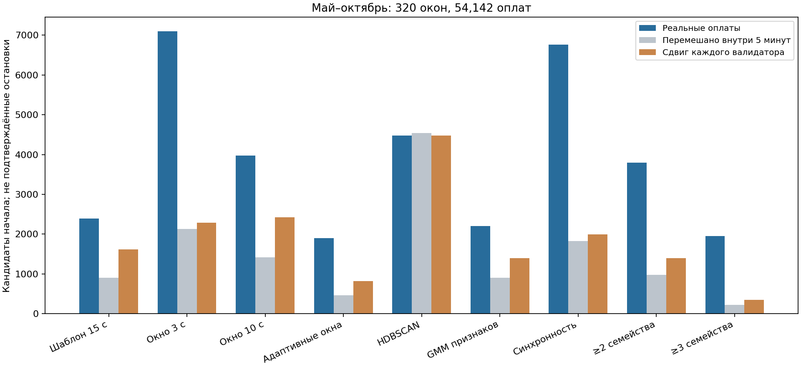
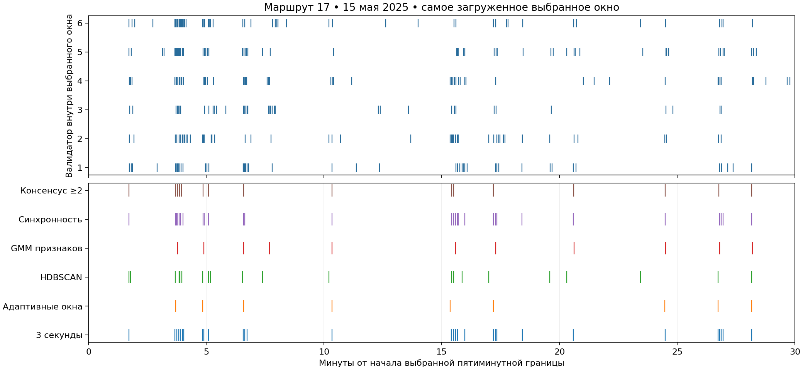

# Многомасштабные пики, ML-кластеры и синхронность валидаторов

TASK-067 • эксперимент 26 сентября 2026 года.

**Проверены 20 вариантов. Синхронность нескольких валидаторов и согласие разных методов действительно дают дополнительный сигнал. Но требование согласия снижает полноту, особенно у небольших посадок.** Один фиксированный 15-секундный шаблон заменён в эксперименте набором масштабов и адаптивной кластеризацией; исходная разметка автоматически не перезаписывалась.

На отложенных данных адаптивный детектор нашёл **1 894** кандидата. **1 374** из них совпадают с HDBSCAN в пределах 5 секунд, против **373,7** совпадения в среднем после независимого сдвига каждого валидатора. Согласие минимум трёх из четырёх семейств даёт **1 952** кандидата против **342** в таком контроле. На валидаторах, не участвовавших в обнаружении, интенсивность первых 10 секунд после этих начал в **6,20 раза** выше, чем после разрушения межвалидаторной синхронности.

Это проверка временных импульсов оплаты. Здесь не измеряется реальная точность названия остановки, открытие дверей, число вошедших без оплаты или высадки.

## Данные и разделение по времени

Сохранена выборка предыдущего аудита: 536 окон по 30 минут, 90 021 успешная оплата, девять маршрутов, 15-е и 18-е числа января–октября 2025 года. Окна выбирались по числу оплат, до запуска детекторов: до трёх самых загруженных сессий на маршрут/день. Поэтому результаты относятся к загруженным участкам, а не ко всем периодам работы сети.

**Январь–апрель: 216 окон / 35 879 оплат** — обучение GMM и калибровка порогов. **Май–октябрь: 320 окон / 54 142 оплаты** — отложенная проверка. Ни параметры GMM, ни численные пороги на май–октябрь не дообучались. Время Europe/Moscow; исходные оплаты неизменны. Raw-selected окна взяты из предыдущего проверенного результата, исходный и выходной SHA-256 записаны в manifest.

В данных есть отдельные поля `device_no` и `garage_number`. Их внутренние ключи позволяют изучать несколько устройств внутри предполагаемой вагонной группы. Используется прежняя проверка конфликтов по устройству/вагону/маршруту/выходу; конфликтные сессии исключены. Это всё ещё inferred_vehicle_pool, не подтверждённая телеметрией идентичность вагона. В артефакте окон сохранены только локальные номера устройств, относительное время, маршрут, дата и ранг, без пассажирских идентификаторов.

Точность исходного времени — **одна секунда**. Поэтому физическую границу 1,5 секунды нельзя напрямую превратить в фильтр «интервал меньше двух секунд — ошибка».

## Что именно реализовано

### Сканирование на нескольких масштабах

Кандидат — каждая уникальная фактическая секунда оплаты, без привязки к границам пятисекундных гистограмм. Для каждого кандидата считаются количества последующих оплат за **2, 3, 5, 10, 20, 40 и 80 секунд**. Короткие масштабы 2/3/5/10 проверены также отдельными детекторами.

Фоновая интенсивность λ(t) оценивается в окрестности до 300 секунд слева и справа, исключая центральные ±80 секунд. Доступная длительность учитывается у краёв, нижний предел — 1/600 оплаты в секунду. Для окна w ожидаемое число μ=λw, наблюдаемое n. Оценка избытка:

`score = sign(n−μ) × sqrt(2 × (n × log(n/μ) − n + μ))`.

Адаптивный вариант выбирает максимум по семи масштабам **для каждого кандидата отдельно**. Порог — 95-й перцентиль максимумов в контрольных тренировочных рядах, а не вручную назначенное число оплат. Дополнительно проверены 90-й и 99-й перцентили. От близких кандидатов остаётся более сильный; подавляются только пересекающиеся интервалы выбранной ширины. Единого периода запрета в 15/30 секунд нет.

Выбранная ширина на тесте: **2 с — 50, 3 с — 46, 5 с — 119, 10 с — 429, 20 с — 749, 40 с — 328, 80 с — 173**. Таким образом, ширина действительно меняется. Это эффективная ширина обнаружения, не измеренная длительность стоянки или всего хвоста.

Параметры всё равно существуют: набор масштабов, область фона, правило подавления и перцентиль. «Адаптивный» не означает «без предположений». 95-й перцентиль относится к кандидатам до подавления пиков, **не означает 5% ложных остановок**.

### Кластеризация по времени — HDBSCAN

В отличие от DBSCAN с единым eps, HDBSCAN строит иерархию плотностных кластеров. Проверены минимальные размеры 3/5/8 событий, `min_samples` равен минимальному размеру, выбор кластеров `leaf`. В основном варианте время преобразуется в интеграл локальной фоновой интенсивности; отдельно проверено обычное время без нормализации. Начало — первая оплата кластера.

У метода нет заранее заданной ширины всплеска, но минимальный размер и правило выбора ветвей иерархии остаются гиперпараметрами. Количество кластеров само по себе ничего не доказывает: на контроле HDBSCAN-5 находит практически столько же кластеров, сколько на реальных данных.

### Кластеризация статистик — Gaussian mixture

Для каждого кандидата вычисляется 13 признаков: нормализованный избыток оплат на семи масштабах, отношение количества оплат после/до на 3/10/40 секундах, интервалы до соседних времён оплат и доля оплат между 10-й и 80-й секундами. Признаки стандартизуются только на тренировочной части.

GMM обучена на 30 000 воспроизводимо выбранных временных кандидатов из реальных и контрольных тренировочных рядов; это **не 30 000 пассажиров**. Проверены 2–6 компонент с диагональной ковариацией, два старта, фиксированный seed, выбор по BIC. Лучшее значение в проверенной сетке — 6 компонент; оно на границе сетки, поэтому глобально оптимальное число кластеров не установлено.

После unsupervised-обучения компоненты оцениваются по обогащению реальными кандидатами относительно перемешанного контроля. Итоговый score — взвешенный posterior-компонентами логарифм обогащения. Это контрастная оценка признаков, **не вероятность остановки**. Порог калибруется на тренировочном контроле; подавление близких кандидатов использует ширину из многомасштабного сканирования. Поэтому GMM и сканирование частично зависимы.

### Синхронность устройств

На 2/3/5/10 секундах считаются **различные** валидаторы, а не только число оплат. Для каждого устройства отдельно оценивается локальная интенсивность; при фоновом пуассоновском приближении вероятность хотя бы одной оплаты за w секунд равна `1−exp(−λ_device×w)`. Из суммы этих вероятностей и дисперсий строится стандартизованный избыток активных устройств. Требуется минимум два устройства. Численный порог выбирается по тренировочному контролю.

Это проверяет именно предложенный механизм одновременного входа через разные валидаторы. Точность межустройственных часов неизвестна; время оплаты не равно времени входа с доказанной задержкой.

### Согласие методов

Четыре семейства: адаптивное сканирование, HDBSCAN-5, GMM признаков, синхронность. Несколько вариантов окон или HDBSCAN не получают дополнительные независимые голоса. В группе учитывается максимум одно событие каждого семейства; диаметр группы ограничен допуском, цепочечного объединения далёких пиков нет. Сравнены допуски 2/5/10 секунд, минимум два или три семейства, а также отдельная пара «адаптивное сканирование + HDBSCAN».

Представитель группы — медиана времён членов, которая может оказаться между зарегистрированными оплатами. Это согласованное время кандидата, не принудительно первая оплата и не истинный момент открытия дверей. Алгоритм объединения жадный; изменение допуска может объединять группы, поэтому число итоговых кандидатов не обязано расти с допуском.

## Контроли и проверка на неиспользованных данных

1. **Uniform:** время каждой оплаты независимо перемешивается в своей фиксированной пятиминутке. Точное число оплат каждого валидатора в каждой пятиминутке сохраняется.
2. **Device shift:** все события одного валидатора внутри пятиминутки циклически сдвигаются на одно случайное число секунд, независимо от других устройств. Сохраняются количество и собственный циклический рисунок оплат устройства; разрушается согласованность между устройствами. Это более содержательный контроль синхронности.
3. Каждый контроль повторён **трижды** на всех окнах. Таблицы показывают среднее; все три значения сохранены в JSON. Это диагностический эксперимент, не узкий доверительный интервал. Циклические границы вносят искусственные разрывы.
4. **Прореживание оплат:** обнаружение повторяется после случайного удаления примерно 20%; совпадение начал считается один-к-одному при допусках 2/5/10 секунд. Исключённые из обнаружения 20% оплат используются для отдельного профиля.
5. **Отложенные валидаторы:** обнаружение работает только на половине известных устройств, профиль измеряется на остальных. Его сравниваем с одним независимым сдвигом этих оставшихся устройств. Это тест межвалидаторного механизма. Сниженное число устройств — дополнительный сдвиг распределения относительно обучения на полном наборе.

Профили суммируют пары «оплата — найденное начало». Перекрывающиеся окна могут учитывать одну оплату несколько раз; эти числа нельзя называть уникальными пассажирами или покрытием исходного массива. Все алгоритмы здесь офлайн, используют будущий контекст. Рандомное прореживание — диагностический тест устойчивости; разделение для обучения модели остаётся хронологическим.

## Результаты на мае–октябре

Последний столбец показывает долю соседних кандидатов с интервалом меньше 20 секунд. Это индикатор возможного дробления одного импульса, не фильтр истинных остановок.

| Метод | Реальные кандидаты | Uniform, среднее | Сдвиг устройств, среднее | Сохранилось после прореживания, ±5 с | Интервалы <20 с |
|---|---:|---:|---:|---:|---:|
| Прежнее начало + затухание | 2390 | 904.3 | 1619.3 | 84.7% | 0.0% |
| Сканирование 2 с | 7929 | 2188.7 | 2164.0 | 77.3% | 70.1% |
| Сканирование 3 с | 7098 | 2128.3 | 2282.0 | 79.0% | 65.8% |
| Сканирование 5 с | 5740 | 1857.0 | 2641.0 | 81.3% | 56.1% |
| Сканирование 10 с | 3971 | 1419.7 | 2418.0 | 82.1% | 35.6% |
| Адаптивные масштабы | 1894 | 457.3 | 821.0 | 81.3% | 0.1% |
| Адаптивный / порог q90 | 2392 | 969.0 | 1252.3 | 81.7% | 0.4% |
| Адаптивный / порог q99 | 1295 | 123.3 | 393.3 | 78.6% | 0.0% |
| HDBSCAN / минимум 3 | 9340 | 9699.3 | 9026.0 | 75.6% | 55.8% |
| HDBSCAN / минимум 5 | 4483 | 4536.0 | 4480.0 | 70.0% | 26.5% |
| HDBSCAN / минимум 8 | 2607 | 2327.0 | 2565.7 | 66.6% | 6.6% |
| HDBSCAN без нормализации | 4485 | 4607.3 | 4558.0 | 69.5% | 26.0% |
| GMM статистик | 2203 | 901.0 | 1395.3 | 76.7% | 1.8% |
| Синхронность валидаторов | 6766 | 1822.3 | 1993.0 | 77.3% | 62.7% |
| Адаптивный + HDBSCAN-5 | 1374 | 167.3 | 373.7 | 75.6% | 0.1% |
| ≥2 семейства / 2 с | 3809 | 807.7 | 1091.3 | 70.4% | 41.6% |
| ≥2 семейства / 5 с | 3801 | 979.7 | 1390.7 | 72.8% | 37.3% |
| ≥2 семейства / 10 с | 3730 | 1176.3 | 1600.7 | 73.6% | 33.6% |
| ≥3 семейства / 5 с | 1952 | 217.7 | 342.0 | 73.6% | 9.8% |
| Пауза 30 секунд | 4740 | 3920.7 | 4717.0 | 92.4% | 0.0% |



**Короткие окна видят синхронность, но часто дробят поток.** Для масштаба 3 секунды 66% соседних кандидатов находятся ближе 20 секунд. Простое согласие любых двух семейств тоже сохраняет дробление: 37% при допуске 5 секунд. Поэтому «все совпавшие пики = отдельные остановки» — неверный следующий шаг.

**Адаптивное сканирование лучше отличает реальные импульсы от сдвинутых устройств, чем прежний шаблон:** 1 894/821=2,31 против 2 390/1 619,3=1,48. Это отношение к конкретному контролю, не precision и не доказательство большей полноты. Сохранность после прореживания 81,3% против 84,7%; число кандидатов меньше.

**Чистая временная кластеризация недостаточна:** HDBSCAN-5 даёт 4 483 реальных кластера против 4 480 при сдвигах. GMM тоже не стал универсальным победителем. Его польза — дополнительная оценка формы, которую можно сопоставить с другими методами.

## Согласие существенно выше контроля

F1 здесь вычисляется между двумя наборами времён, без истинных меток: `2×совпадения/(число A + число B)`. Это согласованность методов, не F1 определения остановки.

| Пара методов | Совпадения ±5 с | F1 согласия, реальные | F1 согласия, сдвинутые устройства |
|---|---:|---:|---:|
| Адаптивные масштабы + GMM статистик | 1231 | 60.1% | 26.3% |
| Адаптивные масштабы + HDBSCAN / минимум 5 | 1374 | 43.1% | 14.1% |
| Адаптивные масштабы + Синхронность валидаторов | 1635 | 37.8% | 18.1% |
| GMM статистик + Синхронность валидаторов | 1958 | 43.7% | 35.1% |
| HDBSCAN / минимум 5 + GMM статистик | 1456 | 43.6% | 14.0% |
| HDBSCAN / минимум 5 + Синхронность валидаторов | 2766 | 49.2% | 11.4% |

Для пары адаптивное сканирование + HDBSCAN подтверждено 72,5% адаптивных кандидатов, но только 30,6% кандидатов HDBSCAN. Контрольный F1 усредняется по трём реализациям. Контроль также согласуется иногда: поэтому нельзя приравнять согласие к истине.

Три семейства дают 1 952 кандидата против 342 на сдвигах — **5,71×**. Из них 73,6% сохраняются после прореживания при ±5 секундах. На отложенных устройствах для 896 начал с полным контекстом найдено 4 080 событий в первые 10 секунд против 658 после сдвига (**6,20×**); в окрестности [−2,+3) секунд — 1 789 против 318 (**5,63×**). Это сильное свидетельство общей импульсной активности устройств, не независимое подтверждение географической остановки.



На графике показано заранее выбранное по потоку окно маршрута 17 за 15 мая. Локальные номера валидаторов обезличены. Хорошо видно, как короткий сканер создаёт несколько пиков внутри одной интенсивной волны; адаптивный метод чаще оставляет одно начало. Это иллюстрация, не вручную размеченный эталон.

## Загруженные маршруты и устойчивость по месяцам

По 36 тестовых окон на маршрутах 17, 12, 11. Последняя колонка — отношение числа оплат отложенных устройств в первые 10 секунд к тому же измерению после сдвига.

| Маршрут / метод | Реальные | Сдвиг устройств | Отложенные устройства: усиление |
|---|---:|---:|---:|
| 17 / Адаптивные масштабы | 280 | 101.7 | 5.96× |
| 17 / Адаптивный + HDBSCAN-5 | 219 | 48.3 | 6.02× |
| 17 / ≥3 семейства / 5 с | 301 | 45.3 | 6.01× |
| 12 / Адаптивные масштабы | 234 | 91.3 | 4.36× |
| 12 / Адаптивный + HDBSCAN-5 | 161 | 42.0 | 4.47× |
| 12 / ≥3 семейства / 5 с | 238 | 37.3 | 4.54× |
| 11 / Адаптивные масштабы | 218 | 99.0 | 4.45× |
| 11 / Адаптивный + HDBSCAN-5 | 158 | 49.3 | 4.83× |
| 11 / ≥3 семейства / 5 с | 222 | 43.7 | 5.74× |

По месяцам: реальные кандидаты / средний контроль со сдвигом устройств.

| Месяц 2025 | Адаптивный | Адаптивный + HDBSCAN | ≥3 семейства |
|---|---:|---:|---:|
| 05 | 307 / 133.3 | 215 / 56.3 | 323 / 53.7 |
| 06 | 286 / 119.7 | 204 / 54.7 | 302 / 53.3 |
| 07 | 322 / 148.3 | 242 / 67.7 | 324 / 64.0 |
| 08 | 293 / 134.7 | 209 / 58.3 | 308 / 51.3 |
| 09 | 356 / 155.0 | 253 / 74.7 | 361 / 64.3 |
| 10 | 330 / 130.0 | 251 / 62.0 | 334 / 55.3 |

Преимущество относительно этого контроля сохраняется во всех шести отложенных месяцах. Все девять маршрутов, включая менее загруженные, доступны в [summary.json](summary.json).

## Посадки 5–6 человек и длинные хвосты

Синтетическая проверка включает 36 сценариев: 5/6/20/50 оплачивающих, 1/3/6 валидаторов, средняя задержка оплаты 2/12/40 секунд. Истинные начала через 180 секунд; добавлен фоновый поток 0,025 оплаты/с. Очередь с обслуживанием минимум 1,5 секунды применяется **ко всем событиям каждого устройства**, включая фон, затем время округляется вниз до секунды. Это гипотеза генератора, а не установленная аппаратная характеристика. При больших задержках известно время условного открытия дверей, но первый наблюдаемый платёж может быть значительно позже.

Проверка попадания в истинное начало допускает ±10 секунд. Каждый сценарий имеет 19 начал; одной реализации на сценарий недостаточно для оценки надёжных доверительных интервалов.

| Сценарий / метод | Precision | Recall |
|---|---:|---:|
| 5–6 человек, быстрые оплаты, 3/6 устройств / адаптивный | 100,0% | 98,7% |
| То же / GMM | 100,0% | 88,2% |
| То же / ≥3 семейства | 100,0% | 89,5% |
| То же / адаптивный + HDBSCAN-5 | 100,0% | 23,7% |
| Все варианты 5–6 человек / прежний шаблон | 83,2% | 69,6% |
| Все варианты 5–6 человек / адаптивный | 91,7% | 45,3% |
| Все варианты 5–6 человек / GMM | 88,8% | 50,9% |
| 20/50 человек, хвост 40 с / прежний шаблон | 81,0% | 86,0% |
| 20/50 человек, хвост 40 с / адаптивный | 90,7% | 68,4% |
| 20/50 человек, хвост 40 с / ≥3 семейства | 88,4% | 33,3% |

**При почти одновременной оплате 5–6 человек адаптивный метод работает хорошо в заданной модели. Требовать обязательного HDBSCAN-подтверждения для каждой небольшой посадки нельзя:** это резко уменьшает полноту. При 5–6 людях, растянутых на длинный хвост, точное начало трудно восстановить всем методам; адаптивный recall при среднем хвосте 40 секунд здесь всего 2,6%. Более сложный метод не гарантирует улучшения каждого сценария.

На реальных данных у 351 адаптивного кандидата в первые 10 секунд есть ровно 5–6 оплат, у GMM — 492. Это наблюдаемая размерность группы оплат, а не число вошедших: предыдущий/следующий хвост может пересекаться. Короткие группы не исключаются конструкцией алгоритма. Детали: [shape-diagnostics.json](shape-diagnostics.json), [synthetic.json](synthetic.json).

## Проверка предположения про 1,5 секунды

Независимый аудит полного 15 января: 238 424 успешных события; 230 627 событий в 208 целиком неконфликтных вагонных сессиях. У 147 сессий по шесть устройств. 5 080 событий имеют конфликт идентичности, 2 717 — отсутствующий вагон; на этом дне конфликтов устройство→несколько вагонов за час не найдено, конфликты относятся к вагону→маршрутам/выходам.

Среди 229 560 соседних пар одного устройства записанные интервалы: 0 с — 12, 1 с — 915, 2 с — 9 002, 3 с — 14 992. Интервал 1 секунда совместим с округлением истинных 1,5 секунд; нулевые интервалы не удалялись автоматически. Поле времени может отличаться от аппаратного момента обслуживания.

На полном дне 25 668 вагонных секунд (пар «сессия — секунда») содержат оплаты минимум на двух устройствах. В десяти независимых циклических контролях среднее 6 231,5 (диапазон 6 060–6 319), то есть **4,12×**. Эта проверка подтверждает сигнал на другом объёме, но относится только к одному дню и не заменяет основное хронологическое испытание. Seeds 20260926…20260935, тот же принцип сдвига на 0…299 секунд по устройству/пятиминутке; результаты сохранены в [validator-review.json](validator-review.json).

## Как использовать результат

Для продолжения остановочной привязки полезно хранить **кандидат начала вместе с признаками и поддержкой методов**, а не немедленно превращать каждый пик в жёсткую остановку:

- адаптивные окна дают основной набор импульсов разной ширины;
- межвалидаторная синхронность и согласие трёх семейств дают более убедительные опорные кандидаты;
- небольшие посадки сохраняются отдельными кандидатами без обязательного HDBSCAN-подтверждения;
- близкие короткие пики внутри общей волны требуют объединения или нескольких гипотез начала, а не увеличения числа остановок;
- длинные хвосты требуют неопределённости времени начала; ни один метод здесь не исправил их полностью.

Новые признаки и диагностические начала реализованы, результаты сохранены. В основной реконструктор именованных остановок они **не продвинуты автоматически**: данный эксперимент оценивает обнаружение импульсов, не проверяет, улучшилась ли остановочная фаза. Общие ошибки методов всё ещё возможны. Следующий критерий принятия — проверить эти кандидаты в последовательностной привязке на будущих датах и независимых ориентирах, сохранив весь исходный поток, включая неопределённые оплаты.

## Источники, реализация и воспроизведение

- [HDBSCAN, официальная документация sklearn](https://scikit-learn.org/stable/modules/generated/sklearn.cluster.HDBSCAN.html): иерархическая плотностная кластеризация без единого eps; настройка min_cluster_size остаётся. Применение здесь — одномерное нормализованное время, не географические кластеры.
- [Gaussian mixture model selection, sklearn](https://scikit-learn.org/stable/auto_examples/mixture/plot_gmm_selection.html): выбор числа компонент по BIC. В нашем эксперименте семантика компонент проверяется контрастом к контролю, истинных меток остановок нет.
- [SciPy peak finding](https://docs.scipy.org/doc/scipy/reference/generated/scipy.signal.find_peaks.html): локальные максимумы и свойства пиков. Для событийного многомасштабного сканирования реализовано собственное подавление пересекающихся окон; SciPy find_peaks непосредственно не вызывается.

Код: `ml/src/tramflow_ml/boarding/multiscale.py`, `multiscale_experiment.py`; проверки: `ml/tests/test_boarding_multiscale.py`; графики: `scripts/plot_multiscale_audit.py`. Новых зависимостей нет. Скрипт использует уже установленный sklearn; matplotlib только для графиков в существующем окружении.

Manifest фиксирует даты, source/code/output hashes, feature/experiment schema и дату разделения. Полная GMM с scaler и весами хранится только в ignored `ml/artifacts/multiscale-v3/model.json`, как экспериментальный артефакт без регистрации или публикации модели. Versioned отчёт содержит агрегаты, пороги и manifest, но не выдаёт модель за production-ready. `shape-diagnostics.json` — дополнительный производный расчёт после основного manifest: количества в [t,t+10), [t,t+80) и выбранный argmax масштаба; он не входит в исходный manifest.

```sh
PYTHONPATH="$PWD/ml/src" OPENBLAS_NUM_THREADS=1 OMP_NUM_THREADS=1 \
  .venv/bin/python -m tramflow_ml.boarding.multiscale_experiment \
  --source /Users/cute/MosTransport2026Hack-worktrees/boarding-real-alignment/ml/artifacts \
  --prior-run /Users/cute/MosTransport2026Hack-worktrees/boarding-dense-audit/ml/artifacts/dense-onset-audit-v2 \
  --out ml/artifacts/multiscale-new --workers 4
```

Для итогового расчёта использован `--prepared ml/artifacts/multiscale-v2/windows.json`: этот кэш получен тем же `prepare` из проверенных исходных партиций; его SHA-256 сохранён. Он не содержит предсказаний. Ранние прерванные каталоги v1/v2 не являются завершёнными экспериментами. Все итоговые результаты относятся к **v3**.

База `a7d273ca6010c4b31d5a8c8533274c27d8c46897`, ветка `agent/boarding-multiscale`, worktree `/Users/cute/MosTransport2026Hack-worktrees/boarding-multiscale`. Интеграция — проверенный локальный patch с сохранением существующих незакоммиченных файлов. Worktree сохранён ради артефактов и неопубликованной ветки. Отдельный read-only review проверил идентичность устройств, контроли, утечки, консенсус; замечание об очереди в синтетике исправлено и покрыто тестом.

Проверки: `make check` завершился с кодом 0 — **1 137 passed** (350 backend, 576 ML, 92 frontend, 119 contracts), 48 SQL skipped. Ruff, mypy, архитектурные границы, frontend build, golden evaluation и Compose прошли. Все хеши manifest и модулей совпали. Независимое повторное обучение дало идентичные параметры и пороги; окно 17-го маршрута за 15 мая структурно идентично по всем полям JSON при одном и четырёх процессах. Новые 15 тестов проверяют сохранение количества по устройству/пятиминутке, круговые интервалы контроля, временные границы, отсутствие будущих дат в fit, один голос семейства, отсутствие цепочечного слияния и общую очередь в синтетике. [verification.json](verification.json).
